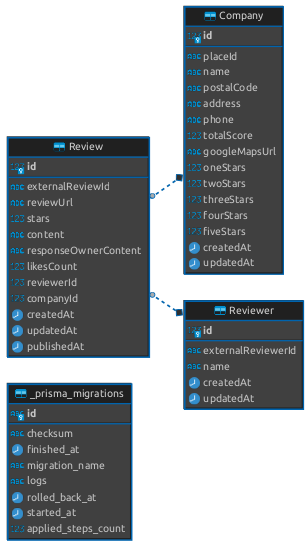

# Scrape Google Maps

Essa aplicação se trata de uma aplicação serverless, onde seu objetivo é fazer o scrape de dados das lojas :

- [NEMA 595](https://goo.gl/maps/mxuvW8VSR4aT4e3e8)
- [NEMA HUMAITA](https://goo.gl/maps/hzxWpA7HdpVC7w7XA)
- [NEMA LEBLON](https://goo.gl/maps/3VQFFWqLNyg4sGf97)

# Alternativas

## Api do Google Places

A api do google places oferece diversas informações, de forma estruturada, a respeito das lojas encontradas no google map.

### Vantagens
- Informações bem estruturadas
- Informação vindas direto da fonte

### Desvantagens
- Pra maioria das informações a api faz cobranças por pelas requisições, possuindo alguns níveis de cobrança a depender da informação desejada
- Só informa 5 avaliações de lojas, por busca, sendo possível apenas order por critérios pre-definidos

### Possíveis formas de implementação
Após criar uma conta para desenvolvedores no google, seria necessário fazer as requisições, de forma adequada, como descrito na documentação do [google places](https://developers.google.com/maps/documentation/places/web-service/search?hl=pt-br). Após a resposta da requisição, os dados seriam armazenados de forma adequada em um banco de dados já criado e adequado ao contexto do projeto.

## Plataforma APIFY

Apify é uma plataforma em nuvem que oferece serviços para automação de web scraping, crawling e automação de workflows na web.

### Vantagens
- Informações bem estruturadas
- 14 dias gratis a patir da criação de conta.
- Bonus de 5 dólares mensais para utilização das suas aplicações
- Fácil de Integrar

### Desvantagens
- Cobrança de 30 dólares por mês
- Caso a api fique fora do ar, a aplicação será afetada

### Possíveis formas de implementação
Após criar uma conta na APIFY, seria necessário fazer as requisições, de forma adequada, como descrito na [documentação](https://docs.apify.com/). Após a resposta da requisição, os dados seriam armazenados de forma adequada em um banco de dados já criado e adequado ao contexto do projeto.

## Scrape Próprio

Realizar um scrape próprio envolve o desenvolvimento personalizado de scripts para extrair dados da web, sem depender de APIs externas.

### Vantagens
- Controle total sobre o processo de extração.
- Não há custos associados ao uso de APIs externas.
- Flexibilidade para obter dados de qualquer fonte online.

### Desvantagens
- É necessário fazer manutenções nos scripts de scraping caso.
- Requer conhecimento técnico para desenvolver e manter os scripts de scraping.
- Pode demandar mais tempo e esforço em comparação com soluções prontas.

## Scrape Próprio
Para implementar um scrape próprio, seria preciso criar scripts personalizados de extração dos dados das páginas do google maps de cada loja, garantindo adaptações específicas às necessidades do projeto. Após o desenvolvimento dos scripts, seria necessário realizar requisições de forma adequada aos websites alvo, processar as respostas e armazenar os dados de maneira apropriada em um banco de dados previamente criado e ajustado ao contexto do projeto, assegurando um fluxo eficiente e controlado de informações.

### Solução Escolhida

- [Api APIFY](https://apify.com/)

Foi escolhido a Api da APIFY por se tratar de uma api que fornece os dados do das lojas disponível no Google Maps de forma suficientemente estruturada e organizada, podendo obter diversos dados.

A solução da API do Google Place foi descartada principalmente por não ser possível obter todas as avaliações. 

Já a solução do Scrape Próprio foi descartada pensando principalmente no tempo que levaria desenvolver, além de que, devido a natureza do projeto, é mais adequado atribuir essa tarefa a um terceiro, sem a necessidade de se preocupar com a manutenção do sistema

# Tecnologias Utilizadas:

- [Serverless Framework](https://www.serverless.com/) - Framework open-source que simplifica o desenvolvimento de aplicações serverless em serviços de nuvem como AWS Lambda, Azure Functions e Google Cloud Functions.

- [Nodejs](https://nodejs.org/en) - Plataforma de execução de código JavaScript no lado do servidor, permitindo o desenvolvimento eficiente de aplicações escaláveis.

- [JavaScript](https://developer.mozilla.org/pt-BR/docs/Web/JavaScript) - Linguagem de programação de alto nível, interpretada e amplamente utilizada para desenvolvimento web.

- [TypeScript](https://www.typescriptlang.org/) - Extensão superset de JavaScript que adiciona tipos estáticos à linguagem.

- [PostgreSQL](https://www.postgresql.org/) - Sistema de gerenciamento de banco de dados relacional de código aberto e altamente extensível.

- [Prisma](https://www.prisma.io/) - ORM (Object-Relational Mapping) de código aberto. pode ser utilizado em aplicação de backend Node.js, incluindo aplicações serverless e microsserviços.

- [Zod](https://zod.dev/?id=introduction) -Biblioteca de declaração e validação de esquema, com ênfase em TypeScript.

# Banco de Dados:
O banco de dados foi projetado com foco na garantia de consistência, eliminando redundâncias sempre que possível. O objetivo foi desenvolver um banco de dados que possa aplicar regras e restrições de forma eficaz, adicionando restrições, chaves únicas e indices, atribuindo a validação e o gerenciamento dos dados da aplicação diretamente no nível do banco de dados.

### Tabelas:
- Company: Tabela que armazena os dados das empresas/lojas vindos do Google Maps
- Reviews: Tabela que guarda dados relevantes das avaliações feitas em cada empresa/loja, contendo a avaliação, comentários, url do comentário entre outros.
- Reviewer - Informações básicas da pessoa que fez a avaliação.

### Relacionamentos:
- Company 1-n Review: Uma empresa/Loja pode possuir uma ou muitas avaliações, mas uma avaliação só pode pertencer a uma empresa/loja

- Reviewer 1-n Review: Um avaliador pode possuir uma ou muitas avaliações, mas uma avaliação só pode pertencer a um avaliador

# Informações Relevantes

## Scheduled Cron
A aplicação presente, possui algumas funções lambdas, sendo a mais relevante, a função responsável por obter os dados da APIFY. Essa função em especial é uma  Scheduled Cron, que não é acessada por http request, mas é chamada a cada 10 minutos buscando constantemente atualizar a base de dados com novas avaliações.

Esse intervalo foi escolhido, visto que, no pior caso, onde existe mais de 600 atualizações, por exemplo, a obtenção e armazenamento desses dados pode demorar até 10 minutos para finalizar. Além disso, como a APIFY disponibiliza apenas 5 dólares mensais, e cada requisição em cada requisição é cobrado 0.060 centavos de dólar, decidi que seria mais interessante ter um intervalo grande o suficiente para evitar gastos, mas curto o suficiente para manter o banco de dados atualizado.

## Precificação
Visto que foi escolhido uma solução onde envolve utilizar a APIFY, uma api paga, a aplicação teria 5 dólares de uso livre mensais, e após finalizar esses créditos seria cobrado 30 dólares mensais para continuar consumido esses dados.

## Lógica de Busca dos Reviews
A solução implementada foi adequada as necessidades de se obter atualizações constantes dos dados, mas tambem buscando obter o melhor desempenho possível. Para implementar essa solução foi levado em consideração as limitações que a apify possui, possuindo apenas configurações simples dos dados e da ordenação dos mesmos.

A APIFY possui alguns parâmetros que ajudam na busca das avaliações:
- Quantidade de avaliações
- Avaliações mais novas
- Data inicial das avaliações

Buscando evitar ler todos os dados de todas as avaliações a cada requisição, lendo apenas as requisições mais novas, primeiramente é feito uma requisição buscando as informações das 3 empresas, onde existe a quantidade de avaliações de cada empresa atualmente. Dessa forma é comparado se a aplicação possui menos ou a mesma quantidade de avaliações no google maps, caso alguma empresa, tenha o valor diferente, é feito novas buscas, apenas para as empresas que possuem diferença de valores. Essa diferença é passada como parâmetro, buscando as avaliações mais novas. Ao Receber os dados das avaliações, os dados ordenados pelos mais antigos, priorizando o armazenamento dos mesmos. Dessa forma é garantido que sempre será buscado apenas as avaliações mais recentes que não estão armazenadas no banco de dados.

## Detalhes de Implementação

Primeiramente foi dispendido um tempo, pesquisando a respeito das possíveis solução para obtenção dos dados, inicialmente pesquisei bastante a respeito da api do  google places, até encontrar a restrição de apenas 5 avaliações por requisição. Após isso busquei paralelamente soluções de apis que poderia fornecer esses dados, enquanto buscava possiveis formas de obter esses dados a partir das apis públicas do google que fornecem os dados para o google maps.

Após me decidir pela api do apify, busquei aprender de forma básica sobre o serverless framework. Paralelamente criei uma conta na AWS e me informei sobre vários serviços que eles disponiblizam como o Lamda para funções serverless, RDS para criar um banco de dados, criação de usuário entre outros.

Após esses estudos e configurações iniciais,passei para estudar o problema em si e a modelar um banco de dados adequado ao problema.

Após essa modelagem, criei uma aplicação inicial com nodejs e a biblioteca da aws-lambda e o prisma, além de configurar o arquivo `.serverless` do serverless framework.

Consumi os dados da api, validei e mapeei os dados de forma a  armazenar no banco de dados.

Ajustei algumas configurações no `.serverless`, como por exemplo um cronjob que busca os dados da apify de 10 em 10 minutos. E por fim subi a ultima versão da aplicação para a AWS.

## Desafios enfrentados:
O maior desafio enfrentado nesse projeto, foi conseguir configurar a ORM Prisma, de modo que a AWS pudesse executar adequadamente. Tive bastante dificuldade inicialmente em descobrir a razão do problema e como utilizar a AWS para me auxiliar nessa investigação. De modo geral os ambientes de desenvolvimento e implantação utilizam runtimes diferentes, portanto eu precisei adicionar uma configuração específica no prisma :

      binaryTargets = ["native", "rhel-openssl-3.0.x"]
  
Na [documentação do Prisma](https://www.prisma.io/docs/orm/prisma-client/deployment/serverless/deploy-to-aws-lambda#deploying-with-the-serverless-framework) é sugerido utilizar o `rhel-openssl-1.0.x`, mas após aprender a ver os logs de erro das funções lambda, eu percebi que a aws requeria o `rhel-openssl-3.0.x`. Após fazer esse ajuste, consegui resolver o problema.

Além disso tive uma considerável dificuldade em utilizar os serviços da aws, principalmente no início, mas ao longo do tempo, fui ganhando confiança e agilidade.

# Referências utilizadas no projeto
- https://developers.google.com/maps/documentation/places/web-service/overview?hl=pt-br
- https://developers.google.com/maps/documentation/javascript/places?hl=pt-br#placeid
- https://medium.com/swlh/google-maps-places-api-28b8fdf28082
- https://www.youtube.com/watch?v=5oG2Q2GMOBE
- https://www.serverless.com/framework/docs/getting-started
- https://www.serverless.com/framework/docs/providers/aws/cli-reference/deploy-function
- https://www.youtube.com/watch?v=BBgefPOUQTM
- https://outscraper.com/google-maps-reviews-api/
- https://jingwen-z.github.io/how-to-get-places-reviews-on-google-maps-by-place-api/
- https://digicade.com.br/places-api-do-google-maps/
- https://www.youtube.com/watch?v=Ke7DSpsszWY
- https://mapsplatform.google.com/pricing/
- https://serpapi.com/blog/using-google-maps-reviews-api-from-serpapi/
- https://help.fullstory.com/hc/en-us/articles/360020623654-How-do-I-use-the-Network-view-in-Dev-Tools-
- https://replit.com/@chukhraiartur/blog-google-maps-reviews-api#main.py
- https://www.youtube.com/watch?v=_Yzr7yBGWQI
- https://stackoverflow.com/questions/47672377/message-internal-server-error-when-try-to-access-aws-gateway-api
- https://github.com/prisma/prisma/discussions/14238
- https://forum.serverless.com/t/message-internal-server-error-on-api-gateway-responses-with-1-5/1117
- https://docs.aws.amazon.com/pt_br/apigateway/latest/developerguide/http-api-troubleshooting-lambda.html
- https://stackoverflow.com/questions/60588274/frequent-timeout-with-app-using-serverless-framework-aws-lambda-gateway-expre
- https://stackoverflow.com/questions/72950837/how-to-integrate-prisma-with-serverless-framework-aws-nodejs-typescript-template
